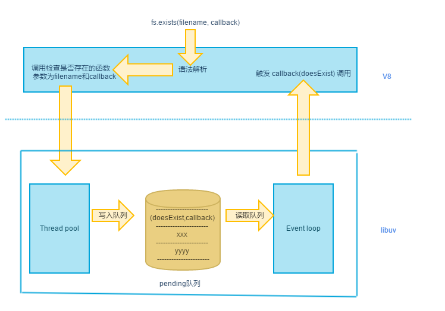

## nodeAdvance（node进阶）

### node特性

> 1，非阻塞I/O工作方式  
> 2，选择用C、C++做了一个 IO 处理层，结合V8引擎，组成了 Node，这个 IO 处理层，就是我们现在说到的 libuv  
> 3， node 使用了 V8 引擎，但是在 node 里面 V8 充当的角色更多的是语法解析层面，另外它还充当了 JavaScript 和 c/c++ 的桥梁  
> 4，Node 中一切皆可异步，但这并不是通过 V8 来实现的，充当这个角色的是 libuv  
> 5，libuv的线程模型，在libuv大体上可以把线程分为两类，一类是事件轮询线程，一类是文件IO处理线程。第一类事件轮询线程是单线程；另外一类称其为文件IO处理线程多少有些不准确，因为他不仅能处理文件IO，还能处理DNS解析，也能处理用户自己编写的node扩展中的逻辑，他是一个线程池，如果你想自己编写一个 c++ 扩展来处理耗时业务的话，就会用上它

### 案例

```javascript
var fs = require('fs');

fs.exists(__filename, function (exists) {
  console.log(exists);
});
```

### 案例解析



### js中const,var,let区别

> 1，const定义的变量不可以修改，而且必须初始化。

```javascript
const b = 2;//正确
const b;//错误，必须初始化
```

> 2，var定义的变量可以修改，如果不初始化会输出undefined，不会报错。

```javascript
var a = 1;
var a;//不会报错
console.log('函数外var定义a：' + a);//可以输出a=1
function change(){
	a = 4;
	console.log('函数内var定义a：' + a);//可以输出a=4
} 
change();
console.log('函数调用后var定义a为函数内部修改值：' + a);//可以输出a=4
```

> 3，let是块级作用域，函数内部使用let定义后，对函数外部无影响。

```javascript
let c = 3;
console.log('函数外let定义c：' + c);//输出c=3
function change(){
	let c = 6;
	console.log('函数内let定义c：' + c);//输出c=6
} 
change();
console.log('函数调用后let定义c不受函数内部定义影响：' + c);//输出c=3
```

### 版本号讲解``^4.15.2``：

> 主版本，你可以在这个版本中做不兼容性改动  
> 小版本，你可以在这个版本上增加共嗯那个，不过要向后兼容  
> 补丁版本，在这里可以做一些bug修复，不过依然要保持向后兼容

#### 在这里来说，主版本号是4，小版本号是15，补丁版本号是2

> 那么^呢，它告诉你使用从``4.15.2``到``5.0.0``（不包括``5.0.0``）之间的最新版本，也就是说它选择的版本号x的取值范围：``4.15.2``<=x<``5.0.0``

### 其他一些命令

> 如果你想查看当前全局安装了哪些包，可以使用npm list -g命令，运行完成后会打印一个目录树，但是如果安装的包比较多的话，在命令行中会打印不全，所以可以采用重定向的方式将打印结果输出到硬盘，例如npm list -g > d:\package.txt。 如果不加-g参数就是打印当前目录下 node_modules 文件夹下的包结构。

> 有时候，我们需要将安装好的包删除掉，如果包是安装在项目目录下的话，其实直接可以把 node_modules 下对应的文件夹删除即可，如果是全局安装的话，那还是使用命令进行卸载吧，比如卸载我们上面安装的 express-generator ： npm uninstall express-generator -g。同样这里的 -g 是说卸载全局安装的 express-generator 包。